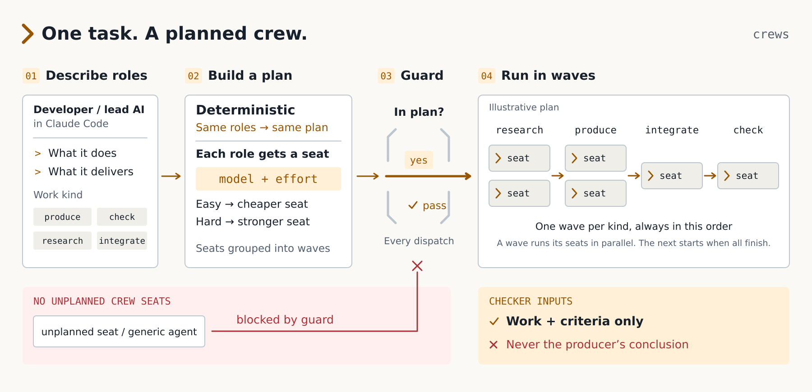

<p align="center">
  <picture>
    <source media="(prefers-color-scheme: dark)" srcset="docs/assets/crews-logo-dark.svg">
    <source media="(prefers-color-scheme: light)" srcset="docs/assets/crews-logo-light.svg">
    
  </picture>
</p>

<p align="center"><b>One task. A planned crew.</b><br>A Claude Code plugin that lets one AI agent bring in a crew of other AI agents, each planned for its role.</p>

# crews

Crews is a plugin for Claude Code that turns a task into a crew plan: task specific roles, each seated on a fixed model and effort, with the number of workers computed from four typed answers. A seat guard hook then refuses generic subagents and any crew seat dispatch that no plan returned, so crew delegation goes through the plan.

This is an independent project for Claude Code. It is not affiliated with or endorsed by Anthropic.

<p align="center">
  <picture>
    <source media="(prefers-color-scheme: dark)" srcset="docs/assets/crews-how-it-works-dark.svg">
    <source media="(prefers-color-scheme: light)" srcset="docs/assets/crews-how-it-works-light.svg">
    
  </picture>
</p>

## What a crew is

The word comes from the Old French *creue*, "an increase", and before that from the Latin *crescere*, "to grow". A *creue* was a reinforcement: the extra people sent in so a small force could take on something bigger. That is what this plugin does for an AI agent working in Claude Code.

When the agent (or you) has a job too big for one context, it does not improvise helpers. It writes down the crew it needs, and crews turns that into a plan:

* **Roles.** Each member of the crew is a role named for what it does to what in this task, with a mission, a deliverable, a write scope and acceptance criteria. A role is one of four kinds: research, produce, integrate or check.
* **Seats.** Every role gets a seat: a fixed model at a fixed effort, chosen from the catalog by the kind of work and how hard it is. Routine work lands on a cheaper seat; hard reasoning on a stronger one. The same roles and answers always give the same plan.
* **Waves.** Seats are grouped into one wave per kind, always in the order research, produce, integrate, check. The calls in a wave are issued together and run in parallel; the next wave starts after the whole wave has returned. So checks always come after the work they check.
* **A blind check.** A check role receives its criteria and the paths of the work, never the producer's conclusion, so its verdict is independent.
* **The guard.** A seat guard hook sits in front of every subagent dispatch. A crew seat is admitted only when the call matches a plan made in the last 24 hours, and a generic agent (`general-purpose`, `claude`, or no type at all) is refused. Other named agents are not affected.

The planner itself dispatches nothing. It returns the exact Agent calls; the session issues them.

## Install

```
claude plugin marketplace add mdalexandre/crews
claude plugin install crews@crews
```

From a local clone of this repository:

```
claude plugin marketplace add ./crews
claude plugin install crews@crews
```

Prerequisites:

* Claude Code.
* [uv](https://docs.astral.sh/uv/). The plugin starts its MCP server with `uv run --project ${CLAUDE_PLUGIN_ROOT} --frozen`, with the Python environment kept in the plugin data directory, so no Python setup is needed beyond uv.
* Hooks start through `sh hooks/run.sh`, which uses `python3` (3.9 or newer) if present, otherwise `uv`; with neither, hooks do nothing (fail open). On a machine with only uv, hooks work without any Python setup.
* Linux or macOS. Windows is not supported.

Installing the plugin gives you:

* the `crew` skill (brief contract and how to call the planner),
* four MCP tools: `crew_catalog`, `crew_check`, `crew_budget`, `crew_plan`,
* 26 pre-generated seat agents (`crews:crew-<kind>-<model>[-<effort>]`), one for each seat the catalog can reach,
* four hooks (see Hooks).

Plugin tools appear in Claude Code as `mcp__plugin_crews_crews__crew_plan` and so on.

## How it works

1. You (the base session) write `roles.json`: a `task` and a list of roles, each named after what it does to what in this task, with a mission, a deliverable, a write scope and acceptance criteria. See [docs/roles-schema.md](docs/roles-schema.md).
2. You give four typed answers about the task: which kind of work it is (`need`), how hard (`difficulty`), whether it splits (`divisible`) and whether it needs an independent check (`needs_verifier`).
3. `crew_plan` validates the roles, computes the budget, seats every role and returns the Agent calls to issue, grouped in waves (research, produce, integrate, check). Every refusal lists all input errors at once.
4. You dispatch exactly those calls. Each prompt is a typed `<crew_task>` brief and each role returns a short typed result.

The planner dispatches nothing itself. The seat guard hook admits a crew seat only when the call matches a plan made in the last 24 hours.

### The cell budget

Computed from the four answers (`crews/budget.py`, thresholds in `crews/catalog.json`):

* fan out when `divisible` is at least 0.60; parallel cells are `min(2 + round(difficulty), 4)` when fanning out, else 1
* a check cell when `needs_verifier` is at least 0.60
* budget = parallel cells, plus 1 lead cell when fanning out, plus 1 check cell when required
* the base session is the lead, so the number of dispatched cells is the budget minus 1 when fanning out
* more than 8 cells, or more cells than the dispatched budget, is refused unless `allow` covers it
* with no answers and the judge off, `outage` gives a budget of 2 cells on the `everyday_implementation` row with a check

### How the seat, model and effort are chosen

Each role carries its own `answers.need`. The catalog (`crews/catalog.json`, version 2.1.0) maps each need to a lead, worker and verify seat, and each role kind picks a column: research and produce use the worker seat, integrate uses the lead seat, check uses the verify seat.

| need | worker | lead | verify |
|---|---|---|---|
| repeatable_task | sonnet low | sonnet medium | sonnet medium |
| bounded_retrieval | sonnet medium | sonnet high | sonnet high |
| everyday_implementation | sonnet medium | sonnet high | sonnet high |
| long_running_agentic | sonnet medium | sonnet xhigh | sonnet high |
| mechanical_verification | haiku | sonnet medium | haiku |
| difficult_review | opus high | sonnet high | opus high |
| integration_architecture | opus high | sonnet high | opus high |
| specialist | fable high | sonnet high | sonnet high |

Two modifiers apply:

* A role `difficulty` of 2.5 or more raises the effort one step on the ladder low, medium, high, xhigh, max. Haiku takes no effort.
* The fable model is only used for the `specialist` need.

Tools follow the kind: research gets Read, Glob, Grep, Bash and WebFetch; produce and integrate get Read, Write, Edit, Bash, Glob and Grep; check gets Read, Glob, Grep and Bash. The label sets the price: use the Opus and fable rows only when the piece itself needs hard reasoning.

A check role is blind by construction. Its brief carries its criteria and the paths of the artifact, never the producer's conclusion.

## Worked example

The files are in [examples/](examples/). The task is "add rate limiting to the public search endpoint", with one produce role and one check role (`examples/produce-and-check.roles.json` and `examples/produce-and-check.answers.json`). The command line twin of `crew_plan`:

```
python3 crew.py plan --roles examples/produce-and-check.roles.json \
  --answers examples/produce-and-check.answers.json \
  --judge off --skills off --brief-check off --run-dir run
```

The answers say: everyday implementation work, difficulty 1.0, mostly not divisible, check required.

```json
{
  "need": {"choice": "everyday_implementation", "confidence": 0.8, "probabilities": {"everyday_implementation": 0.8, "repeatable_task": 0.2}},
  "difficulty": {"score": 1.0},
  "divisible": {"noul": 0.3},
  "needs_verifier": {"noul": 0.9}
}
```

The plan (trimmed from the real output):

```json
{
  "budget": {
    "need": "everyday_implementation",
    "fan_out": false,
    "parallel_cells": 1,
    "check_required": true,
    "budget": 2,
    "dispatched_budget": 2
  },
  "cells": 2,
  "models": ["haiku", "sonnet"]
}
```

Wave 1 (produce), one call:

```json
{
  "subagent_type": "crew-produce-sonnet-medium",
  "description": "search-endpoint-rate-limiter",
  "model": "sonnet",
  "effort": "medium",
  "record_path": "run/roles/search-endpoint-rate-limiter/rate-limiter-record.md"
}
```

Wave 2 (check), one call:

```json
{
  "subagent_type": "crew-check-haiku",
  "description": "rate-limiter-behavior-checker",
  "model": "haiku",
  "effort": null,
  "record_path": "run/roles/rate-limiter-behavior-checker/rate-limiter-verdict.md"
}
```

The `prompt` of the produce call, verbatim, is what the dispatch carries:

```
<crew_task version="2" kind="produce" role="search-endpoint-rate-limiter" cell="search-endpoint-rate-limiter">
<objective>
add a token bucket rate limiter to the public search endpoint
</objective>
<context>
Crew task: add rate limiting to the public search endpoint
</context>
<authority>
- src/api/search.py as the current handler
- Invent no requirement beyond these sources. If they are not enough to decide, stop BLOCKED and name what is missing.
</authority>
<inputs>
- NONE
</inputs>
<scope>
READ: whatever the objective needs
WRITE: src/api/search.py, src/api/rate_limit.py
MUST_NOT: write outside WRITE; create a report, findings or summary file; start other agents
</scope>
<acceptance>
A1: unauthenticated callers are limited to 30 requests per minute per IP
A2: a limited caller gets HTTP 429 with a Retry-After header
</acceptance>
<output_contract>
Write artifacts inside WRITE only. Return exactly these lines and nothing else:
STATUS: COMPLETE|PARTIAL|BLOCKED
ARTIFACTS: <paths you wrote, comma separated, or NONE>
RESULT: <one sentence>
VERIFY: <acceptance IDs met, and each check command with its one line result>
DECISION: NONE|<the one decision you need from the orchestrator>
Do not return command transcripts or narrate your steps.
</output_contract>
<stop_conditions>
COMPLETE only when every acceptance criterion is met and checked.
PARTIAL when some are met; name the rest under DECISION.
BLOCKED when an input or the authority is missing, or meeting a criterion needs a write outside WRITE. Never work around a block by inventing a requirement or widening scope.
</stop_conditions>
</crew_task>
```

Through the plugin the same plan is requested with the `crew_plan` tool, and `subagent_type` carries the plugin namespace (`crews:crew-produce-sonnet-medium`). Issue each wave's calls in one message, copy `subagent_type`, `description` and `prompt` verbatim, and wait for the wave before the next. When a later wave reads an earlier role's result, save it with `crew record --transcript <agent output file> --out <record_path>`.

## Hooks

The plugin registers four hooks. All of them fail open: a defect in a hook never blocks a session. Hooks run with your user privileges.

| Hook | Event | What it does | How to turn it off |
|---|---|---|---|
| seat_guard | PreToolUse on Agent and Task | Blocks generic agents (`general-purpose`, `claude`, an empty `subagent_type`, or a catalog generic name) and any crew seat dispatch that no plan from the last 24 hours returned (same `subagent_type`, description and prompt). Other named agents are allowed. | Set the plugin option `seat_guard_mode` to `advise` (warn instead of block), or set `CREWS_SEAT_GUARD=0` (allow everything), or `CREWS_SEAT_GUARD_MODE=advise` in the environment, or disable the plugin. |
| qa_leak_check | PreToolUse on Agent and Task | Advisory only. Warns on stderr when a check seat prompt matches the brief leak regex (for example, it carries the producer's verdict). Never blocks. | Disable the plugin. |
| session_start | SessionStart | Prints one line saying crews plans subagent crews. | Disable the plugin. |
| inline_budget | UserPromptSubmit, PostToolUse, PreToolUse on Bash | Off by default. When the plugin option `inline_budget_enabled` is true it counts Read, Edit, Write, MultiEdit, NotebookEdit, Bash, Grep and Glob calls per turn and denies a Bash call once the count reaches `inline_budget` (default 5), unless `crew_plan` was called or a crew seat was dispatched that turn. It never acts inside a subagent. | Set `inline_budget_enabled` to false (the default). |

Plugin options (asked when the plugin is enabled): `typesafe_api_key` (sensitive, optional), `inline_budget_enabled` (default false), `inline_budget` (default 5), `seat_guard_mode` (`block` or `advise`, default `block`).

If your organization allows managed hooks only, plugin hooks are disabled. The planner still works; only the enforcement is lost.

## Optional: the TypeSafe judge

By default nothing in crews calls a network service. The planner is deterministic: you declare the four answers.

If you configure a TypeSafe API key (the `typesafe_api_key` plugin option, or `TYPESAFE_API_KEY` / `TYPESAFE_API_KEY_FILE` for the command line), `crew_plan` can ask the live judge to answer the task and per role questions instead, and can use it for skill routing and a semantic brief leak check. With no key, `judge`, `skills` and `brief_check` fall back to off with one warning, and declared answers always stand.

What a live call sends to `https://api.typesafe.ai/v1/systemone`:

* judge, task answers: the task text and the question definitions
* judge, role answers: the task text and, for each role, its name, kind, mission, write scope and professional frame
* skill routing: the task, each role's name and mission, and the ids, names and descriptions of candidate skills found on your machine
* brief check: the authored text of a check role's brief

The key goes only in the Authorization header. Each live call is queued and runs only after you approve that exact call with `crew approve <call_id> --fingerprint <fingerprint>` (list the queue with `crew gates`); approval is single use. The skill routing and brief check verdicts are recorded but never change a plan while the catalog marks them as not calibrated. Without a key, none of this runs.

## Security

* Plugins run arbitrary code with your privileges. Review `hooks/hooks.json`, `.mcp.json` and `hooks/*.py` before you enable it.
* The hooks can block: a generic subagent dispatch, an unplanned crew seat dispatch (seat_guard), and, only if you enable it, a Bash call after the inline budget is spent. They write nothing outside the plugin data directory (the inline budget keeps its per session counter there) and fail open.
* The MCP server is started with `uv` and keeps its state under `CREWS_HOME` (the plugin data directory under the plugin, `~/.crews` for command line use). It writes nothing into the plugin install directory.
* The plugin makes network calls only to TypeSafe, only when a key is configured and only after you approve the call. See above for what is sent.

Report vulnerabilities as described in [SECURITY.md](SECURITY.md).

## Uninstall

```
claude plugin uninstall crews@crews
claude plugin marketplace remove crews
rm -rf ~/.claude/plugins/cache/crews
```

The last line is needed because Claude Code keeps the uninstalled plugin's files in its cache, marked orphaned, and they still contain the `crew-*.md` seats; removing the cache directory leaves none behind.

Claude Code deletes the plugin data directory (`${CLAUDE_PLUGIN_DATA}`, which holds the server environment, plan index and run records) when the last installation of the plugin is removed, unless you pass `--keep-data`. If you want to be sure, look for it under `~/.claude/plugins/data/` and remove any `crews` directory there.

If you also used the command line, remove what it wrote:

```
python3 crew.py uninstall --agents-dir <the agents directory you passed to install>
rm -rf ~/.crews
```

`crew.py uninstall` removes only files that carry the generated marker `<!-- claude-crews:generated -->` (the `crew-*.md` seats); it never touches a file it did not write. The plugin does not write seats into `~/.claude/agents`: its seats ship inside the plugin and go away with it.

## Command line

`python3 crew.py --help` lists the verbs. The useful ones: `plan`, `budget`, `record`, `list`, `install --agents-dir DIR`, `check --agents-dir DIR`, `uninstall --agents-dir DIR`. Set `CREWS_HOME` to choose where state is written.

## Development

See [CONTRIBUTING.md](CONTRIBUTING.md). Third party licenses are in [THIRD_PARTY_NOTICES.md](THIRD_PARTY_NOTICES.md). Crews is released under the MIT License.
